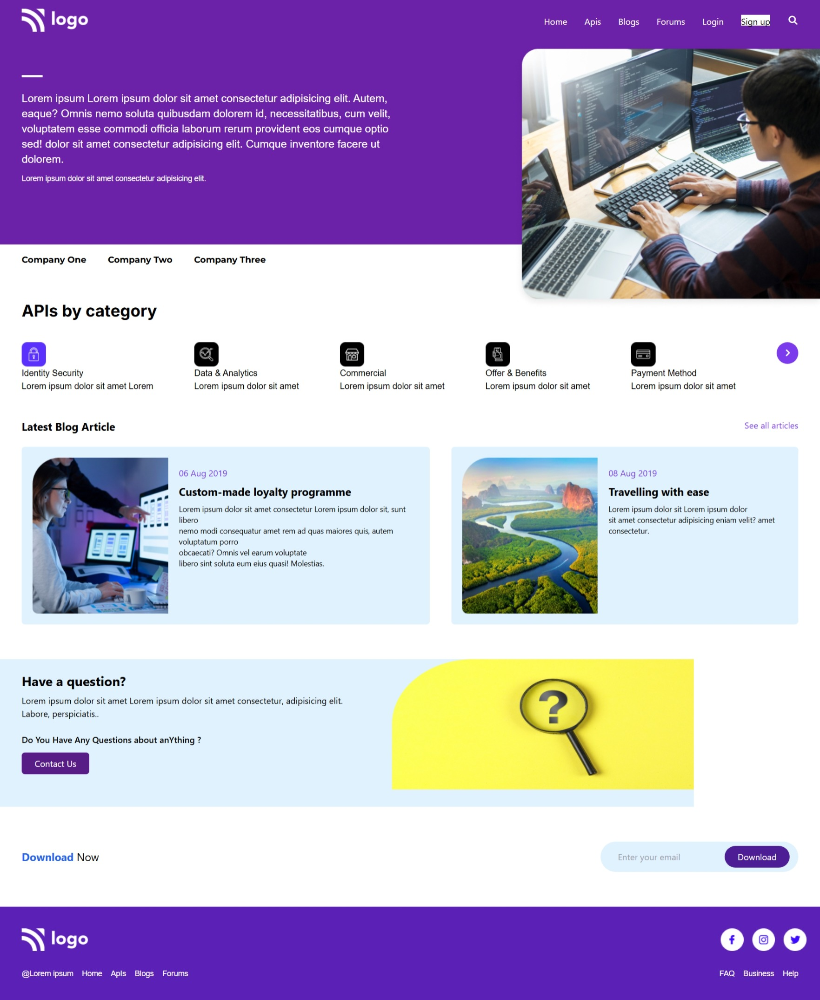

# 🌐 Web Development Landing Page

A modern, responsive landing page built using **HTML**, **Tailwind CSS**, and **Font Awesome**. This project demonstrates clean UI structure, responsive design practices, and reusable component-based layout.

---

## 🚀 Features

* ✅ Fully responsive design (mobile → desktop)
* 🎨 Styled with Tailwind CSS utility classes
* 🔤 Custom typography using Google Fonts
* 🧭 Navigation bar with responsive menu
* 🖼️ Hero section with image + text layout
* 🏢 Company showcase section
* 📦 API category grid
* 📰 Blog/article cards
* 📣 Call-to-action (CTA) section
* 📩 Email capture / download section
* 🔻 Footer with links and social icons


## preview

[live](https://elbineldhose007.github.io/web-devolepment/)



---

## 🛠️ Tech Stack

* **HTML5**
* **Tailwind CSS (CDN)**
* **Font Awesome**
* **Google Fonts**

---

## 📂 Project Structure

```
project/
│
├── index.html
├── /assets
│   ├── Logo.png
│   ├── IMAGE HERE.png
│   ├── Rectangle.png
│   ├── Rectangle Copy.png
│   ├── Rectangle_12.png
│   ├── Group 97.png ... Group 104.png
│   └── Rectangle_38-2 (1).png
│
└── README.md
```

---

## ⚙️ Setup & Usage

1. Clone the repository:

   ```
   git clone https://github.com/your-username/your-repo-name.git
   ```

2. Open the project folder:

   ```
   cd your-repo-name
   ```

3. Run the project:

   * Simply open `index.html` in your browser

---

## 📱 Responsiveness

This project is designed with a **mobile-first approach**:

* `hidden`, `flex`, `lg:block`, `xl:flex` used for breakpoints
* Layout shifts from **column → row** on larger screens
* Optimized spacing and typography scaling

---

## 🎯 Key Sections Breakdown

### 🔹 Hero Section

* Branding + navigation
* Large hero image
* Introductory text

### 🔹 API Categories

* Grid layout
* Icons + titles + descriptions

### 🔹 Blog Section

* Card-based UI
* Image + metadata + description

### 🔹 CTA Section

* User engagement prompt
* Contact button

### 🔹 Download Section

* Email input field
* Call-to-action button

---

## 🎨 Customization

You can easily customize:

* **Colors** → Tailwind classes (`bg-purple-800`, etc.)
* **Fonts** → Tailwind config (`fontFamily`)
* **Layout** → Flex/Grid utilities
* **Content** → Replace placeholder text & images

---

## ⚠️ Notes / Improvements

* Replace placeholder images with optimized assets
* Add JavaScript for:

  * Mobile menu toggle
  * Form validation
* Improve accessibility (ARIA labels, alt text)
* Convert into component-based framework (React, Vue, etc.) if scaling

---

## 📄 License

This project is open-source and available for personal or commercial use.

---

## 👨‍💻 Author

ELBIN ELDHOSE.

---

## ⭐ Acknowledgements

* Tailwind CSS for utility-first styling
* Font Awesome for icons
* Google Fonts for typography